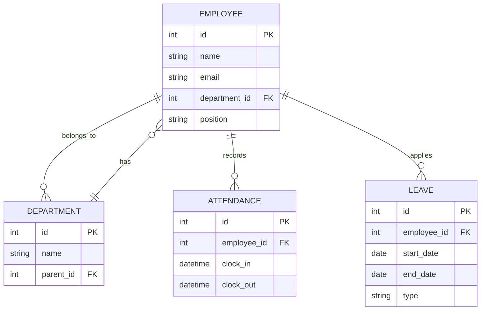

# 🛠️ 시스템 설계 문서

이 문서는 HRMS 시스템의 주요 설계 내용을 담고 있습니다. 각 섹션을 클릭하여 세부 내용을 확인하세요.

## 1. 개요
- HRMS 시스템은 인사 정보 관리, 근태 관리, 조직 관리 등 핵심 HR 기능을 제공하는 웹 애플리케이션입니다.
- Django(백엔드)와 React(프론트엔드)를 기반으로 설계하여 확장성과 유지보수성을 확보합니다.
- 주요 목표:
  - 모듈화된 컴포넌트 설계
  - 보안 강화 (JWT, 암호화)
  - RESTful API 설계
  - 컨테이너화된 배포 환경

2. 시스템 아키텍처 개요

- **백엔드 서버:** Django + Django REST Framework
- **프론트엔드:** React.js + TypeScript + TailwindCSS
- **데이터베이스:** MySQL
- **인증/보안:** JWT, Bcrypt
- **컨테이너:** Docker, Docker Compose
- **CI/CD:** GitHub Actions
- **로그/모니터링:** Sentry, ELK Stack

3. 컴포넌트 설계

#### 3.1 웹 서버 (Django)
- URL 라우팅 및 뷰(View) 정의
- 모델-뷰-컨트롤러 패턴 기반
- DRF를 통해 JSON API 제공

#### 3.2 프론트엔드 (React)
- 컴포넌트 단위 재사용성 확보
- 전역 상태 관리는 Redux 또는 Context API
- 라우팅: React Router

#### 3.3 데이터베이스 (MySQL)
- 관계형 모델링
- 주요 테이블: Employee, Department, Attendance, Leave, Payroll, UserRole
- 인덱스 및 외래 키 제약 조건 설계

4. 데이터베이스 모델링

5. API 설계

- **인증 API**
  - `POST /api/auth/login` - 로그인
  - `POST /api/auth/register` - 회원가입

- **사용자 관리 API**
  - `GET /api/users/` - 사용자 목록 조회
  - `GET /api/users/{id}` - 사용자 상세 조회
  - `PUT /api/users/{id}` - 사용자 정보 수정

- **조직 관리 API**
  - `GET /api/departments/` - 부서 목록 조회
  - `POST /api/departments/` - 부서 생성

- **근태 관리 API**
  - `GET /api/attendance/` - 출퇴근 기록 조회
  - `POST /api/attendance/` - 출퇴근 체크

- **휴가 관리 API**
  - `GET /api/leaves/` - 휴가 내역 조회
  - `POST /api/leaves/` - 휴가 신청

6. 보안 설계

- **JWT 인증**: 로그인 후 발급된 토큰으로 모든 API 호출 시 인증 헤더에 포함
- **암호화**: 사용자 비밀번호는 Bcrypt를 이용해 해시 처리
- **권한 검사**: DRF의 Permission 클래스로 엔드포인트별 접근 제어

7. 배포 및 운영 계획

- **로컬 개발 환경**: Docker Compose로 백엔드, 프론트엔드, DB 컨테이너 실행
- **CI/CD**: GitHub Actions로 테스트 및 빌드 자동화
- **스테이징/프로덕션**: 추후 AWS ECS 또는 Kubernetes 배포 고려

8. 확장성 및 유지보수

- 모듈화된 코드 구조로 기능 추가 용이
- 테스트 코드 작성 (pytest, Jest)
- 문서화 도구 (Swagger, Redoc) 연동

